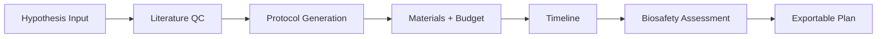
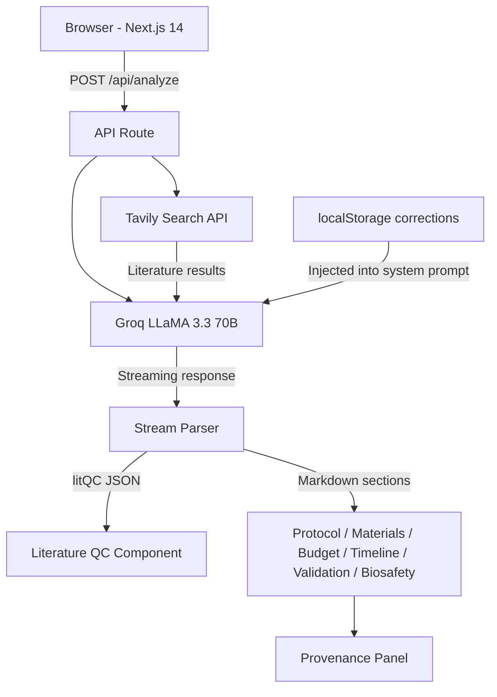
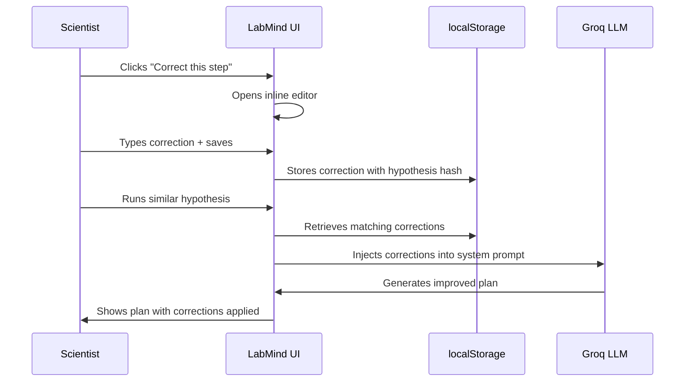

# LabMind

**From hypothesis to runnable experiment plan under 60 seconds — sourced, costed, and biosafety-screened.**

    

---

## The Problem

Scientists lose 7 to 10 days on experiment planning before a single pipette tip is loaded — searching literature, assembling protocols, sourcing reagents, pricing materials, and assessing biosafety risk across disconnected tools. Existing platforms (Benchling, Labguru) are electronic lab notebooks optimized for recording outcomes, not for generating the plan that precedes them. General-purpose AI assistants hallucinate catalog numbers, fabricate DOIs, and provide no mechanism for scientists to audit, correct, or propagate domain knowledge across future sessions.

---

## The Solution

LabMind accepts a precisely stated scientific hypothesis and, within seconds, produces a complete, structured experiment plan: literature-grounded protocol steps with numbered source citations, a supplier-resolved materials table flagged for items requiring manual catalog verification, a costed budget with institutional overhead, a phase-gated timeline, a validation framework with statistical controls, and a biosafety classification — all exportable to PDF. Every claim is traced to a real literature source retrieved at query time. Nothing is fabricated.



---

## Key Features

| Feature | Description |
|---|---|
| Literature QC | Tavily advanced search retrieves up to 5 real papers at query time; Groq classifies the hypothesis as Novel, Similar, or Exact match against the corpus and exposes the references |
| Sourced Protocol | Numbered protocol steps are annotated with `[Source: ...]` inline citations drawn from retrieved abstracts, eliminating unsourced AI fabrication |
| Verified Materials Table | Reagents, suppliers, and catalog numbers are generated with `[VERIFY]` links on any item the model cannot confirm with high confidence — honesty over false precision |
| Costed Budget | Itemized cost table with per-unit pricing and a 25% institutional overhead line, formatted for grant budget justification |
| Phase-Gated Timeline | Experiment phases with duration estimates and dependency mapping rendered as a structured table |
| Validation Framework | Success criteria, positive/negative controls, and recommended statistical tests scoped to the specific assay type |
| Biosafety Classification | Low/Medium/High risk rating with a plain-language explanation of containment requirements, generated from the protocol context |
| Expert Feedback Loop | Scientists correct individual protocol steps inline; corrections are persisted to localStorage under a DJB2 hash of the hypothesis and automatically injected into the system prompt on subsequent analyses |

---

## Technical Architecture



---

## Tech Stack

| Layer | Technology | Purpose |
|---|---|---|
| Framework | Next.js 14 (App Router) | Server components, API routes, streaming |
| Language | TypeScript 5.7 | End-to-end type safety |
| LLM | Groq `llama-3.3-70b-versatile` | Sub-second streaming inference at 70B scale |
| Literature Search | Tavily Core API | Real-time academic and scientific web retrieval |
| UI Components | Radix UI + shadcn/ui | Accessible, unstyled primitives with composable design |
| Styling | Tailwind CSS 4.2 | Utility-first CSS with CSS variable design tokens |
| Forms | React Hook Form + Zod | Schema-validated input handling |
| Persistence | Browser localStorage | Expert corrections keyed by DJB2 hypothesis hash |
| Export | Browser Print API | Full-plan PDF generation with print-specific CSS layout |
| Deployment | Vercel | Edge-optimized serverless with streaming response support |
| Analytics | Vercel Analytics | Usage telemetry without third-party trackers |

---

## How It Works

**1. Hypothesis processing**
The scientist enters a falsifiable hypothesis specifying the independent variable, dependent variable, target magnitude of effect, and proposed mechanism. The hypothesis string is hashed (DJB2) to generate a stable key for retrieving any prior expert corrections.

**2. Tavily literature retrieval**
A `POST /api/analyze` request triggers a parallel Tavily advanced search (`searchDepth: "advanced"`, `maxResults: 5`) using the query `scientific research: {hypothesis}`. Results are mapped to a structured `LiteraturePaper[]` interface containing title, authors, year, DOI, and abstract. Retrieval failure is non-fatal; the route proceeds to LLM generation with an empty corpus.

**3. Groq streaming with structured output**
The API route constructs a system prompt that (a) injects any stored expert corrections from prior sessions, (b) provides the retrieved abstracts as grounding context, and (c) specifies an exact output contract: a `{"litQC": {...}}` JSON object on the first line followed by six labeled markdown sections. The Groq `llama-3.3-70b-versatile` model streams the response at up to 4,000 tokens via a `ReadableStream` returned as `text/plain`.

**4. Stream parsing — litQC JSON extraction**
The client accumulates streaming chunks in a string buffer and applies a brace-counting algorithm to detect the closing `}` of the litQC JSON object without buffering the full response. Once the JSON boundary is found, `JSON.parse` extracts the `signal` (`"novel"` | `"similar"` | `"exact"`) and reference array. The remainder of the buffer is routed to section parsing.

**5. Section rendering**
`parseSections()` splits the remaining markdown on `## ` headings, producing a `Record<string, string>` keyed by section name. Each section is rendered by a dedicated component: `ExperimentPlan` handles the numbered protocol with inline correction controls; `TabContent` renders Materials, Budget, Timeline, Validation, and Biosafety as markdown with `[VERIFY]` links resolved to live search URLs. The `ProvenancePanel` displays literature references for any selected protocol step.

**6. Feedback loop injection**
When a scientist clicks "Correct this step" on any protocol step, an inline editor opens below that step. On save, `saveCorrection(hypothesis, stepTitle, correctionText)` merges the new correction into the localStorage array at key `lm_corrections_{djb2Hash}`. On the next analysis of the same (or structurally similar) hypothesis, `loadCorrections()` retrieves the array and the API route prepends a formatted `Expert corrections from previous reviews:` block to the system prompt, causing the model to respect the scientist's domain knowledge in subsequent outputs.

---

## The Feedback Loop

The core design principle of LabMind is that AI-generated plans improve through interaction with domain experts, not through retraining. Every correction a scientist makes is stored locally and automatically applied to future plans for the same research question. The model learns the lab's conventions, preferred reagent concentrations, institutional protocols, and assay-specific constraints — without any model fine-tuning or server-side state.



The result is a planning assistant that becomes more accurate the more a research group uses it — compounding institutional knowledge rather than discarding it.

---

## Sample Inputs

| Domain | Hypothesis |
|---|---|
| Gut Health | Supplementing C57BL/6 mice with Lactobacillus rhamnosus GG for 4 weeks will reduce intestinal permeability by at least 30% compared to controls, measured by FITC-dextran assay, due to upregulation of tight junction proteins claudin-1 and occludin. |
| Cell Biology | Replacing sucrose with trehalose as a cryoprotectant in the freezing medium will increase post-thaw viability of HeLa cells by at least 15 percentage points compared to the standard DMSO protocol, due to trehalose's superior membrane stabilization at low temperatures. |
| Diagnostics | A paper-based electrochemical biosensor functionalized with anti-CRP antibodies will detect C-reactive protein in whole blood at concentrations below 0.5 mg/L within 10 minutes, matching laboratory ELISA sensitivity without requiring sample preprocessing. |
| Neuroscience | CRISPR-Cas9-mediated knockout of the APOE4 allele in iPSC-derived neurons will reduce amyloid-beta 1-42 secretion by at least 40% relative to isogenic APOE4 controls within 72 hours, as quantified by sandwich ELISA, implicating APOE4 in amyloidogenic processing independent of tau pathology. |

---

## Getting Started

```bash
git clone https://github.com/dlawiz83/LabMind.git
cd labmind
npm install
cp .env.example .env.local
npm run dev
```

Open `http://localhost:3000` and enter any scientific hypothesis to generate a full experiment plan.

---

## Environment Variables

| Variable | Description | Required |
|---|---|---|
| `GROQ_API_KEY` | API key from [console.groq.com](https://console.groq.com) | Yes |
| `TAVILY_API_KEY` | API key from [tavily.com](https://tavily.com) | Yes |

Both keys are used server-side only and are never exposed to the browser. Copy `.env.example` to `.env.local` and populate both values before running locally.

---


Most AI lab tools either require expensive fine-tuning on proprietary data, force researchers into a new workflow, or produce outputs with no provenance trail. LabMind does none of these. It plugs into the moment that costs scientists the most time — the blank-page planning phase, and produces a document that a PI can hand directly to a graduate student. The feedback loop means that unlike a static prompt wrapper, LabMind gets materially better for each lab that uses it, without touching a training pipeline.

The architecture is intentionally minimal: one API route, one streaming connection, one localStorage key per hypothesis. There is no database to provision, no model to host, and no vendor lock-in beyond two commodity API keys. The full plan generates in under 60 seconds on cold start.
